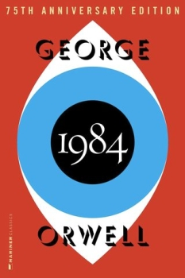

# Reading group: George Orwell's 1984

Source: <https://melikian.asu.edu/research-and-partnerships/projects-and-initiatives/reading-group/1984-Orwell>

George Orwell’s 1984 is often grouped with two other dystopian novels from the first part of the 20th century: We (Yevgeny Zamyatin, 1924) and Brave New World (Aldous Huxley, 1932).  In Reading Global: In Big Brother’s Shadow we take Orwell’s warning on state totalitarianism as a start-point, for exploring core themes—surveillance, propaganda, censorship (and self-censorship), atomization, perpetual war and thought control—that remain politically relevant.

Orwell’s Oceania does not exist—that is, a super-state whose centralized economy is built around war, under strict Party control, with a leader (Big Brother/Stalin) whose authority rests in emotional appeal, by channeling hate against traitors (Goldstein/Trotsky) and external enemies (Eurasia or Eastasia).  But elements of the world he imagines—continuous surveillance and the threat of denunciation by family members or workplace colleagues; the outlawing of positive, connective emotions (love, loyalty, mutuality) and the elevation of fear and hatred (“There will be no laughter, except the laugh of triumph over a defeated enemy” – O’Brien, Part Three, Section III); extreme polarization in political competition, and attempts to control memory/interpretation of the past—have continued to resonate.

Orwell’s vision has been a reference point for people living under repressive regimes (including, for example, Mao’s China, and Soviet Russia). 1984 has also sparked the imagination of novelists worldwide, including those who, like Orwell and his protagonist Winston Smith, value connection with the past (the paperweight, “… a little chunk of history that they’ve forgotten to alter” (145)  the journal, the pleasure of reading (184-5) and lament its loss, especially when driven by an impulse to destroy such connections.